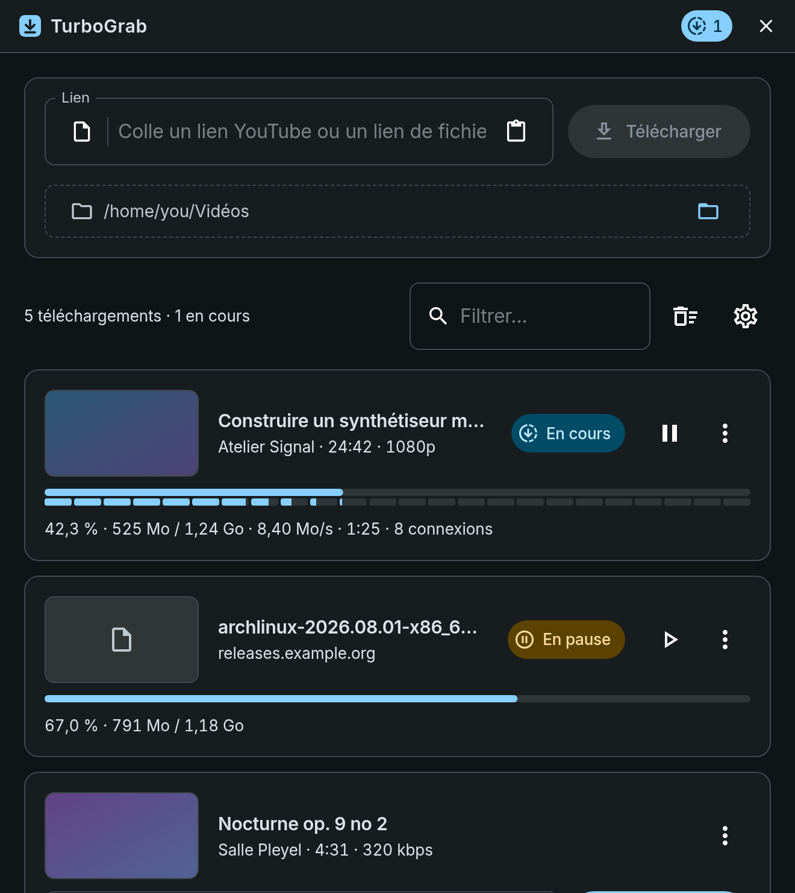
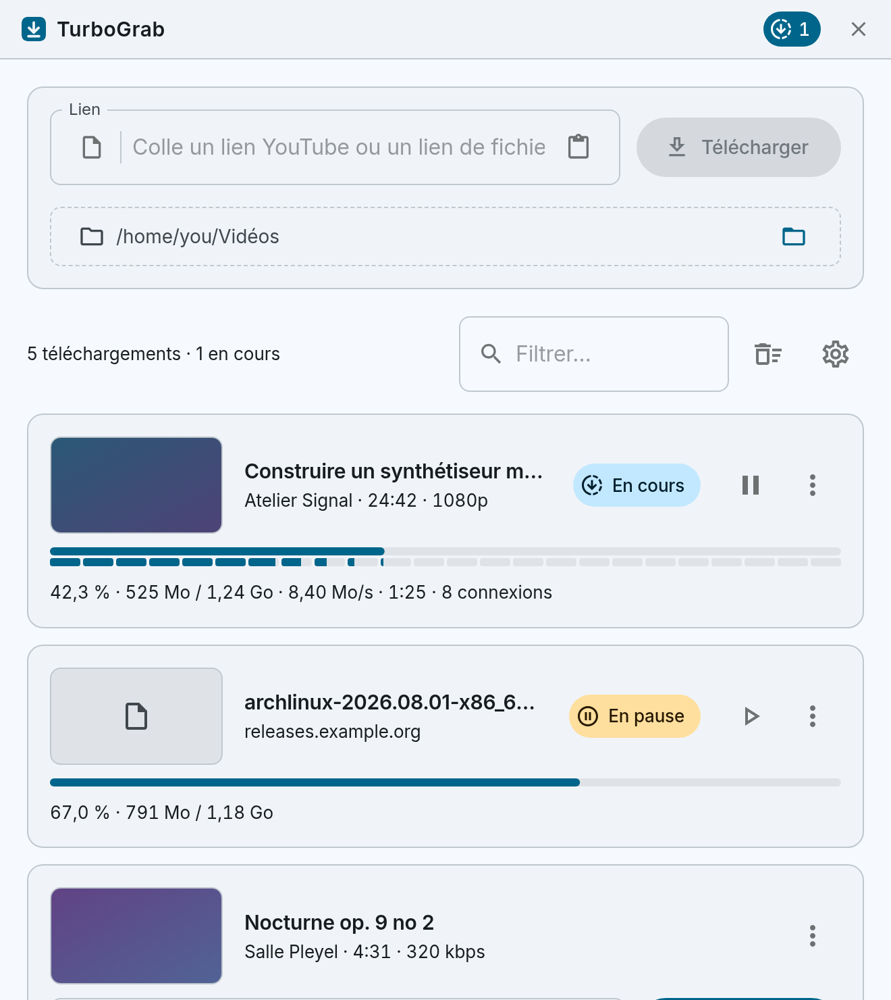

<div align="center">


# TurboGrab

**Paste a link. Get the file.**

A desktop download manager that works out what your link is, then downloads it
as fast as the server allows — YouTube video and audio, or any direct file, in
one list.

<a href="#install"></a>


<br />

<table>
<tr>
<td></td>
<td></td>
</tr>
</table>

</div>

---

## What it does

There is no mode to pick and no tab to choose. Paste a link, press **Download**,
and TurboGrab decides:

| You paste | What happens |
| --- | --- |
| A **YouTube** link | The format list is fetched first. You choose video or audio and a quality — with the estimated size next to each — then it downloads and merges with the bundled `ffmpeg`. |
| **Anything else** | A direct HTTP download, split across up to 8 parallel connections whenever the server supports byte ranges. |

If the guess is ever wrong, the icon at the left of the link field opens a menu
to override it.

## Why you might want it

**It is genuinely fast.** Range-capable servers are fetched in 4 MiB chunks over
8 connections with a work-stealing queue, so a single slow chunk never leaves
the other connections idle. The strip under the progress bar shows the real
shape of the transfer, connection by connection.

**Pause actually resumes.** Per-chunk byte counts live in a sidecar file next to
the download, so resuming picks up exactly where it stopped — after a pause,
after a restart, after a crash. If a server can't resume, the card says so
*before* you pause.

**Expired links are recoverable.** Signed URLs from S3, CloudFront or
googlevideo die while a download is paused. TurboGrab keeps every byte already
on disk and asks for a fresh address instead of starting over — the equivalent
of IDM's "refresh download address".

**It tells you the numbers.** `525 Mo / 1,24 Go`, transfer rate, time left,
connection count, and how many retries a flaky connection is costing you.

**It stays out of the way.** Closing the window hides it to the tray; downloads
keep running. Errors are one plain sentence, with the raw diagnostic tucked into
**Settings → Log** for when you actually want it.

Light and dark follow your system. French and English throughout, units and
dates included.

<a name="install"></a>

## Install

Linux only. Native install under `~/.local` — no root, no package manager.
You get both a `turbograb` command and an app-launcher entry.

```bash
git clone https://github.com/Rajaonarison-Andry-Misandratra-Fiderana/turbograb
cd turbograb
npm install
./scripts/fetch-sidecars.sh linux     # yt-dlp + static ffmpeg/ffprobe
./scripts/install.sh --build
```

Already have a release binary? `./scripts/install.sh`.
Changed your mind? `./scripts/uninstall.sh` — your downloads and settings stay.

```
~/.local/lib/turbograb/                    ytfetcher + yt-dlp, ffmpeg, ffprobe
~/.local/bin/turbograb                     wrapper on PATH
~/.local/share/applications/               .desktop entry
~/.local/share/icons/hicolor/*/apps/       icons
```

The sidecars sit in a private lib dir rather than `~/.local/bin` so they can
live next to the executable — `.sidecar()` resolves against `<exe_dir>` —
without `ffmpeg`/`ffprobe`/`yt-dlp` colliding with whatever is already on your
PATH.

### Where your data lives

```
~/.local/share/com.fiderana.turbograb/downloads.json   download history
~/.local/share/com.fiderana.turbograb/settings.json    folder, language, theme
```

## Development

```bash
npm install
npm run tauri dev
```

`npm run build` runs `tsc` with `noUnusedLocals`, so a dead import fails the
build instead of shipping. `cargo test --manifest-path src-tauri/Cargo.toml`
covers the filename, range and resume logic.

```
src/                     React UI — components, MUI theme, i18n, formatting
src-tauri/src/lib.rs     Rust core — commands, progress events, state, sidecars
src-tauri/binaries/      Bundled yt-dlp / ffmpeg / ffprobe, per target triple
docs/architecture.md     How it all fits together
```

ffmpeg resolution is identical in dev and in a bundled build: the sidecar next
to the executable wins if it actually runs, otherwise the first `ffmpeg` on
`PATH` (with `ffprobe` beside it). See `ffmpeg_location` in `lib.rs`.

**Read [docs/architecture.md](docs/architecture.md)** before changing the
downloader or the theme — it documents the invariants that keep a segmented
download from silently corrupting its output, and two MUI traps that quietly
produce a light-themed dialog on a dark window.

## Sidecar binaries

Fetch them with the script rather than by hand:

```bash
scripts/fetch-sidecars.sh linux
FORCE=1 scripts/fetch-sidecars.sh      # refresh what's already there
```

It writes `src-tauri/binaries/<stem>-<triple>` for `yt-dlp`, `ffmpeg` and
`ffprobe`, then fails if `ldd` finds a shared `libav` link.

> **Never copy a distro ffmpeg in here.** That was done once: those binaries
> link `libavcodec.so.NN` & friends, so they died on the next host ffmpeg
> upgrade (9.0 moved `libavdevice.so.62` → `.so.63`) and never ran on a user's
> machine at all. The breakage was invisible during development because
> `ffmpeg_location()` falls back to a system ffmpeg. Only fully static builds
> belong here:
>
> ```bash
> ldd src-tauri/binaries/ffmpeg-x86_64-unknown-linux-gnu   # "not a dynamic executable"
> ```

<a name="packaging"></a>

## Packaging

| Artifact | Needs anything installed? |
| --- | --- |
| `.AppImage` | **No** — bundles webkit2gtk and all three sidecars |
| `.deb` | Yes — declares `libwebkit2gtk-4.1-0`, `libgtk-3-0`, `libayatana-appindicator3-1` |

```bash
APPIMAGE_EXTRACT_AND_RUN=1 NO_STRIP=1 npm run tauri build -- --bundles deb,appimage
```

Before shipping `src-tauri/target/release/ytfetcher`, check it is a real release
build. A dev build can sit at that same path and look identical, but starts with
"could not connect to localhost" because it wants the Vite dev server:

```bash
strings -a src-tauri/target/release/ytfetcher | grep -c 'assets/index-'   # 1+ = frontend embedded
```

<details>
<summary><b>Regenerating the icons</b></summary>

`src-tauri/icons/source/icon.svg` is the master. To rebuild the whole set (all
sizes plus `.icns` / `.ico` / Android / iOS):

```bash
rsvg-convert -w 1024 -h 1024 src-tauri/icons/source/icon.svg -o /tmp/icon.png
npm run tauri icon -- /tmp/icon.png
```

</details>

## Troubleshooting

**The window is blank white.** WebKitGTK's DMABUF renderer aborts inside Mesa's
GBM teardown on some hybrid Intel + NVIDIA machines, killing the web process and
leaving an empty webview. TurboGrab sets `WEBKIT_DISABLE_DMABUF_RENDERER=1`
itself; if it still happens, go one step further:

```bash
WEBKIT_DISABLE_COMPOSITING_MODE=1 turbograb
```

**A download failed and the message is vague.** That is deliberate — cards show
one short sentence. The exact text is in **Settings → Log**, and on the card's
⋮ menu as *Copy error details*.

**YouTube downloads suddenly stopped working.** YouTube changes break older
yt-dlp releases. Refresh the sidecar:

```bash
FORCE=1 scripts/fetch-sidecars.sh linux
```

**The app vanished when I closed it.** It hid to the system tray and is still
downloading. Left-click the tray icon to bring it back, or use the tray menu to
quit for real.

## Notes

- Downloading from YouTube may violate its Terms of Service. Personal and
  educational use.
- Keep `yt-dlp` current — it is the piece that breaks first.
